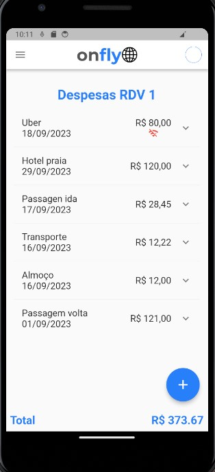

# Onlfy
<h1 align="center">
Onlfy
</h1>

<p float="left"  align="center">
  
  
</p>

## 🔖 About

- The **Onlfy** project is a mobile application where you can register yours travel expenses, providing details such as day, description, amout expend, locale and image. It is possible to list, edit, and delete the expense data stored on the database provided by Onfly. It has a feature that allows you to record expenses offline, synchronizing with the API as soon as the device reconnect whit the internet.

## 🚀 Technologies

- Dart(Flutter)
- Clean Archtecture
- State Manegement with Modular and Change Notifier
- REST API connection
- Error Management with Either
## :airplane: Instalation

```bash
$ git clone https://github.com/Robertrodrigues000/onfly.git

$ cd onfly

$ flutter run lib/main.dart

```

## :bar_chart: Tests

```bash
$ flutter test
```
